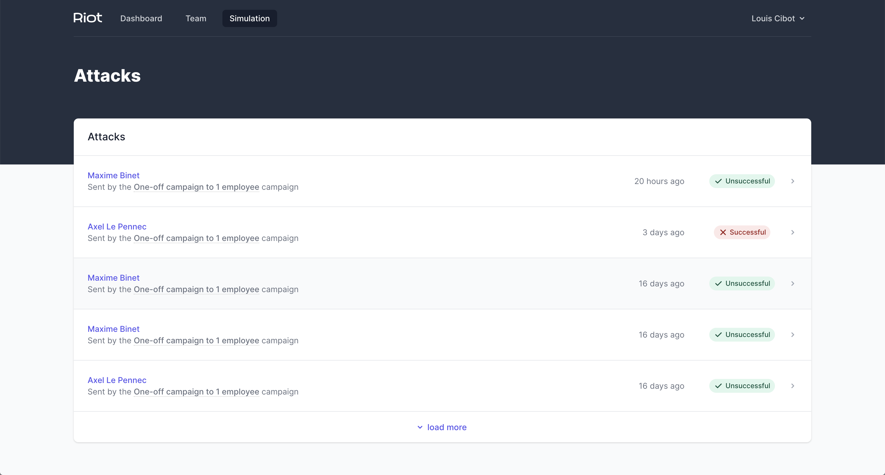

  
   
   

# Riot frontend challenge

Hi there!

Since you got here, you're probably taking a part in our recruitment process for Front-end developer position, right?

We're super happy to hear that! Getting right to it — the main purpose of this test is to check out your frontend skills. We'd like to get to know your approach of solving the following problems:

- Implement functionalities for the User stories (first one is already done).
- Use Vuejs UI library with its related ecosystem parts [Vue Apollo](https://apollo.vuejs.org/).
- Provide the best possible User Experience (being strict with the designs, responsiveness, hover/focus states of interactive elements everything to your liking and ideas).

Feel free to open an issue if you got any questions or suggestions! Once it's ready, send us a repository link at louis@tryriot.com.

Happy coding and cheers,

Louis, CTO @ Riot

## Table of Contents

- [Riot frontend challenge](#riot-frontend-challenge)
  - [Table of Contents](#table-of-contents)
    - [User stories](#user-stories)
    - [Design](#design)
    - [API](#api)
    - [Technicall: 30 minutes technical interview and debriefing](#technicall-30-minutes-technical-interview-and-debriefing)

### User stories

- [ ] I am able to list the attacks paginated 5 by 5 from recent one to old one.
- [ ] When I click on load more, it loads 5 more attacks if there are some.
- [ ] If the Campaign is NULL, the text should be `Sent individually`
- [ ] There is an hover state on the table row, see the design.

### Design

In `/design` directory you can find a preview of User Interface, design guidelines and all the required assets.

Icons can be found [HERE](https://heroicons.dev/)

### API

You will find a graphQL API on this endpoint: <https://riot-technical-test-api.herokuapp.com/v1/graphql>

you can use a Graphiql online website: <https://lucasconstantino.github.io/graphiql-online/> to preview and try the API.

### Technicall: 30 minutes technical interview and debriefing

Once finished, send me your repository link by email: louis@tryriot.com & book a call [HERE](https://calendly.com/louis-cibot/code)
